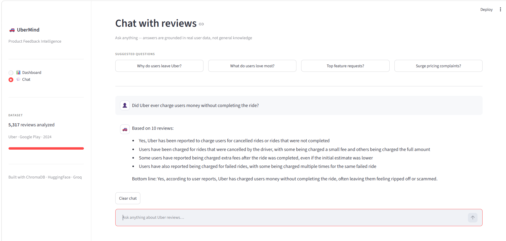
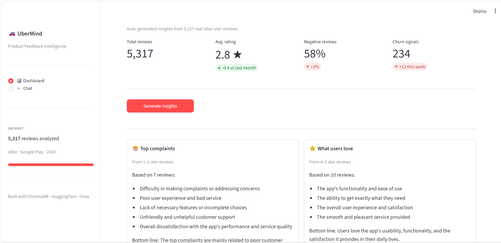

# 🚗 UberMind — Product Feedback Intelligence

> An AI-powered chatbot that analyzes **5,317 real Uber user reviews** from December 2024 — answering questions that ChatGPT literally cannot.

[](https://khaireddineladhari-product-feedback-intelligence.hf.space)
[](https://python.org)
[](https://streamlit.io)
[](https://trychroma.com)

---

## 🎯 What Makes This Different

Most chatbots answer from general knowledge. UberMind answers from **real user data**.

| Question | ChatGPT | UberMind |
|---|---|---|
| *"Did Uber charge users for cancelled rides?"* | ❌ "I don't have access to recent reviews..." | ✅ "Based on 9 reviews: users were charged up to $50 for 3 failed rides..." |
| *"Is Uber customer support helpful?"* | ❌ "I cannot access specific user experiences..." | ✅ "Based on 8 reviews: support described as 'terrible', 'a joke', 'non-existent'..." |
| *"Were rides cancelled at the last minute?"* | ❌ "I don't have December 2024 data..." | ✅ "Based on 5 reviews: 4 users had rides cancelled after drivers accepted..." |

---

## 🖥️ Demo

### 💬 Chat — Ask anything about Uber reviews


### 📊 Dashboard — Auto-generated insights


> **Try it live:** [khaireddineladhari-product-feedback-intelligence.hf.space](https://khaireddineladhari-product-feedback-intelligence.hf.space)

---

## 🏗️ Architecture

```
Raw Uber Reviews (CSV)
        │
        ▼
 Data Cleaning & Filtering
 (English only, 20+ chars)
        │
        ▼
 HuggingFace Embeddings          ChromaDB
 (all-MiniLM-L6-v2)    ──────►  Vector Store
 Runs locally on CPU             (Persistent)
        │
        ▼
  User asks question
        │
        ▼
 Smart Query Engine
 ┌─────────────────────────────┐
 │  Metadata filters by score  │
 │  Dynamic n_results (5-10)   │
 │  Semantic similarity search │
 └─────────────────────────────┘
        │
        ▼
  Groq LLM (llama-3.3-70b)
        │
        ▼
  Structured Answer + Quote
```

---

## ✨ Features

### 🤖 Smart RAG Chatbot
- Retrieves the **most relevant reviews** for each question using semantic search
- Applies **metadata filters** based on question intent (complaint → low scores, praise → high scores)
- Maintains **conversation memory** (last 10 messages)
- Returns **structured answers** with real user quotes and a bottom line conclusion

### 📊 Admin Dashboard
- Auto-generates insights on: Top Complaints, What Users Love, Churn Signals, Feature Requests
- Results cached in session — no wasted API calls

### 🛡️ Production-Grade Safety
- **tiktoken** — counts tokens before sending to prevent overflow
- **Tenacity** — auto-retries on rate limit errors
- **Token-aware query sizing** — simple questions use fewer reviews (saves API quota)
- Error handling — app never crashes, always shows a user-friendly message

---

## 🛠️ Tech Stack

| Layer | Technology | Purpose |
|---|---|---|
| **UI** | Streamlit | Frontend interface |
| **Vector DB** | ChromaDB | Store & search embeddings |
| **Embeddings** | HuggingFace `all-MiniLM-L6-v2` | Convert reviews to vectors |
| **LLM** | Groq `llama-3.3-70b-versatile` | Generate answers |
| **Data** | Pandas | Cleaning & processing |
| **Token Safety** | tiktoken | Count tokens before API call |
| **Retry Logic** | Tenacity | Handle rate limit errors |
| **Hosting** | HuggingFace Spaces | Free live deployment |

---

## 📁 Project Structure

```
ubermind/
│
├── app.py                      # Streamlit UI
├── index.py                    # Core logic (embeddings, chat, insights)
├── requirements.txt            # Dependencies
├── uber_reviews_clean.csv      # Cleaned dataset (5,317 reviews)
├── uber_reviews_without_reviewid.csv  # Raw dataset
└── README.md
```

---

## 🚀 Run Locally

### 1. Clone the repo
```bash
git clone https://github.com/khair-eddine-ladhari/product-feedback-intelligence.git
cd product-feedback-intelligence
```

### 2. Create virtual environment
```bash
python -m venv venv
venv\Scripts\activate        # Windows
source venv/bin/activate     # Mac/Linux
```

### 3. Install dependencies
```bash
pip install -r requirements.txt
```

### 4. Add your API key
Create a `.env` file:
```
GROQ_API_KEY=your_groq_api_key_here
```
Get a free key at [console.groq.com](https://console.groq.com)

### 5. Run the app
```bash
streamlit run app.py
```

> **First run:** The app will embed all 5,317 reviews locally (takes ~5 minutes). After that it's instant.

---

## 💡 Best Questions to Ask

These questions show the full power of the system:

```
Did Uber ever charge users money without completing the ride?
Is Uber customer support actually helpful when something goes wrong?
Did other users have their ride cancelled at the last minute?
Is the Uber app getting worse or better based on December 2024 reviews?
Why are users switching to Bolt?
```

---

## 📊 Dataset

- **Source:** Google Play Store reviews
- **Size:** 5,317 reviews
- **Period:** December 2024
- **Columns used:** `content`, `score`, `at`, `thumbsUpCount`
- **Cleaning:** English only, 20+ character reviews, null removal

---

## 🧠 How the Smart Filtering Works

```python
# Question: "What do users complain about?"
where = {"score": {"$lte": 2}}   # Only 1-2 star reviews

# Question: "What do users love?"
where = {"score": {"$gte": 4}}   # Only 4-5 star reviews

# Question: "Is support helpful?"
where = {"score": {"$lte": 3}}   # Mixed reviews for balance
n_results = 8
```

This means answers are always based on the **right subset** of reviews — not random ones.

---

## ⚠️ Limitations

- Answers are based on Google Play reviews only — not internal Uber data
- No real user identification (reviews are anonymous)
- Re-embeds on HuggingFace restart (first load takes ~10 minutes)
- Daily API token limit on free Groq tier

---

## 👤 Author

**Khair Eddine Ladhari**

[](https://github.com/khair-eddine-ladhari)

---

## 📄 License

Apache 2.0 — free to use, modify, and distribute.